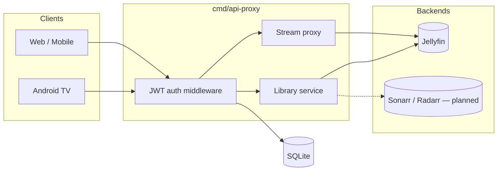

# Stoganet API Proxy

Single HTTP/JSON API that aggregates [Jellyfin](https://jellyfin.org) (and eventually Sonarr, Radarr, qBittorrent) behind one surface for Stoganet client apps (Android TV, mobile, web).

Clients talk only to this proxy. Backend credentials never leave the server.

Licensed under [MIT](./LICENSE).

## Architecture at a glance



The proxy issues its own JWT pair on login. Jellyfin credentials are stored server-side and never sent to clients. Playback goes through the proxy's `/stream/{jfId}` endpoint — clients never talk to Jellyfin directly.

## REST API

The OpenAPI spec lives at [`api/openapi.yaml`](./api/openapi.yaml). The server is generated from it via `make gen` — do not edit `internal/gen/` by hand.

### Auth

| Method | Path | Auth | Description |
|--------|------|------|-------------|
| `POST` | `/auth/login` | none | Username + password login (proxied through Jellyfin) |
| `POST` | `/auth/refresh` | none | Refresh token rotation |
| `POST` | `/auth/logout` | JWT | Revoke a refresh token |
| `POST` | `/auth/logout/all` | JWT | Revoke all refresh tokens for the caller |
| `POST` | `/auth/quick-connect/start` | none | Begin a Jellyfin Quick Connect handshake |
| `POST` | `/auth/quick-connect/poll` | none | Poll Quick Connect approval |

### Library

| Method | Path | Auth | Description |
|--------|------|------|-------------|
| `GET` | `/library` | JWT | Paginated media browse (`type`, `limit`, `cursor`) |
| `GET` | `/library/{id}` | JWT | Item detail + stream URL |
| `GET` | `/home` | JWT | Home screen sections (continue watching, latest, etc.) |

### Stream

| Method | Path | Auth | Description |
|--------|------|------|-------------|
| `GET` | `/stream/{jfId}` | JWT | Byte-stream proxy to Jellyfin; handles Range / 206 natively |

### Health

| Method | Path | Auth | Description |
|--------|------|------|-------------|
| `GET` | `/healthz` | none | Liveness probe |

### Authentication

All endpoints except auth and `/healthz` require `Authorization: Bearer <access_token>`. The proxy issues HS256 JWTs. Tokens are short-lived; clients must refresh via `/auth/refresh` using the long-lived refresh token.

Quick Connect lets users approve a login from the Jellyfin web UI without typing a password. Start the handshake, display the returned `code` to the user, then poll until approved or expired.

### Catalog IDs

Catalog IDs are proxy-scoped composite strings, not raw Jellyfin UUIDs.

| Format | Meaning |
|--------|---------|
| `tmdb:movie:603` | Item matched by TMDB ID (movie) |
| `tmdb:tv:1396` | Item matched by TMDB ID (TV series) |
| `jf:<uuid>` | Item with no TMDB match, addressed by Jellyfin UUID |

Always pass catalog IDs from list/detail responses back to the proxy. Never construct Jellyfin UUIDs manually.

### Library detail response

`GET /library/{id}` returns a `LibraryDetail` with a `play` block when the item is playable:

```json
{
  "id": "tmdb:movie:603",
  "title": "The Matrix",
  "year": 1999,
  "type": "movie",
  "poster": "https://jellyfin.example.com/Items/.../Images/Primary",
  "backdrop": "https://jellyfin.example.com/Items/.../Images/Backdrop/0",
  "overview": "...",
  "state": "playable",
  "genres": ["Action", "Sci-Fi"],
  "runtime": 136,
  "cast": [{ "name": "Keanu Reeves", "role": "Actor" }],
  "seasons": 0,
  "play": {
    "stream_url": "https://api.stoganet.com/stream/<jfId>"
  }
}
```

To start playback, hit `stream_url` with the same `Authorization: Bearer <access_token>` header used for every other request. The proxy fetches Jellyfin credentials server-side and pipes the byte stream through. Range requests are supported — send `Range: bytes=N-M`, expect `206 Partial Content`.

`state` is always `playable` until Sonarr/Radarr integration is added.

### Error shape

```json
{
  "error": { "code": "item_not_found", "message": "item not found" },
  "request_id": "..."
}
```

Error codes: `invalid_credentials`, `account_locked`, `token_expired`, `token_invalid`, `jellyfin_session_expired`, `backend_unavailable`, `item_not_found`, `rate_limited`, `validation_failed`, `internal`.

## Repository layout

| Path | What's there |
|------|-------------|
| [`api/openapi.yaml`](./api/openapi.yaml) | OpenAPI spec; source of truth for all types and routes |
| [`cmd/api-proxy/`](./cmd/api-proxy) | Binary entrypoint: config, wiring, graceful shutdown |
| [`internal/gen/`](./internal/gen) | Code-generated server stubs and types — do not edit |
| [`internal/auth/`](./internal/auth) | JWT issue/verify, refresh token store, Jellyfin login adapter |
| [`internal/media/`](./internal/media) | Media domain types, ID mapping, service, mapper |
| [`internal/clients/jellyfin/`](./internal/clients/jellyfin) | Thin Jellyfin HTTP client (auth, items) |
| [`internal/config/`](./internal/config) | Env-based config loader |
| [`internal/db/`](./internal/db) | SQLite connection and schema migrations |
| [`internal/http/`](./internal/http) | HTTP server, JWT middleware, request handlers, stream proxy |

## Running

### Docker Compose (local dev)

```sh
cp compose/.env.example compose/.env
# Edit compose/.env: set JELLYFIN_URL, JELLYFIN_API_KEY, PROXY_BASE_URL, and a 32-byte JWT_SIGNING_KEY
docker compose -f compose/docker-compose.yml up
```

API available at `http://localhost:8080`.

### Direct

```sh
export JELLYFIN_URL=http://localhost:8096
export JELLYFIN_API_KEY=your-api-key
export PROXY_BASE_URL=http://localhost:8080
export JWT_SIGNING_KEY=$(openssl rand -hex 32)
export DB_PATH=./api-proxy.sqlite
export LISTEN_ADDR=:8080

make run
```

## Environment variables

| Variable | Required | Description |
|----------|----------|-------------|
| `JELLYFIN_URL` | yes | Base URL of your Jellyfin instance |
| `JELLYFIN_API_KEY` | yes | Jellyfin API key (Settings → API Keys) |
| `PROXY_BASE_URL` | yes | Public base URL of this proxy (e.g. `https://api.stoganet.com`) — used to build `stream_url` in responses |
| `JWT_SIGNING_KEY` | yes | Secret for HS256 JWT signing — minimum 32 bytes. Generate: `openssl rand -hex 32` |
| `DB_PATH` | yes | SQLite file path (e.g. `/data/api-proxy.sqlite`) |
| `LISTEN_ADDR` | yes | TCP address to bind (e.g. `:8080`) |

## Development

```sh
make gen      # regenerate internal/gen/ from api/openapi.yaml
make test     # run all tests with -race
make lint     # golangci-lint
make build    # compile to dist/api-proxy
make tidy     # go mod tidy
```

The OpenAPI spec is the single source of truth. Change the spec, run `make gen`, then implement. The generated `StrictServerInterface` is what the server must satisfy — the compiler enforces it.
